# Vinylize_IoT


With this guide i will show you how to control a ledstrip using a telegram bot, to simulate a digitally controlled vinyl record player. You wil be able to change the LP(vinyl record) and automatically switch to that LPs RPM(revolutions per minute), aswell as adjusting the volume.
<br /><br /><br />

## Requirements:
- ESP32 DevKit V1 board
- NeoPixel LED strip 
- Wires
- Laptop with the Arduino IDE installed
- Internet connection
- Phone with Telegram installed
<br /><br /><br />

## Step 1: Creating your Telegram Bot

- Open Telegram and search for the BotFather.
- Use the command "/newbot" to create a new bot.
- Give the bot a name and username.
- Save the bot token, which will be used in your code to connect to the bot.<br /><br />
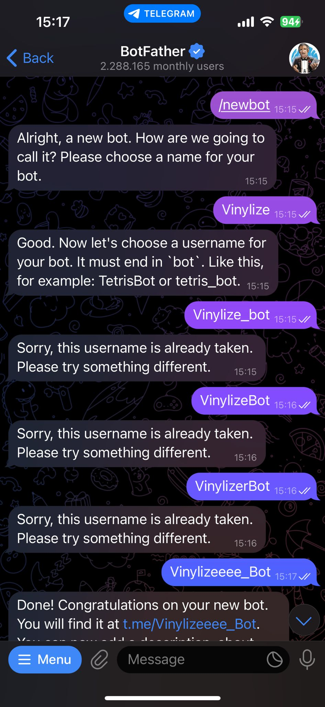 <br />
  
You can now message your new bot. Make sure you are chatting with your own bot, and not with the BotFather. <br /><br />
<br />
<br />You can click the link to go to your own bot.<br /><br />
 <br />
<br />To get this response from your own bot, you will have to keep following the guide.
<br /><br /><br />

# Step 2: Set Up Your ESP32 with Arduino IDE

- Go to Tools -> Boards -> Board Manager.<br /><br />
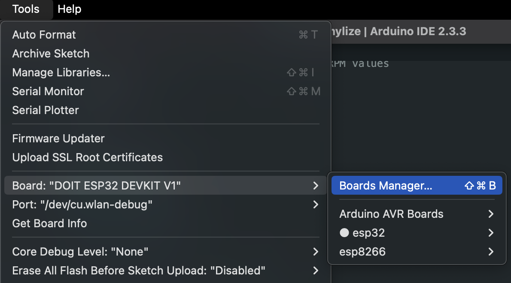 <br />
- While here, look for esp32 and install esp32 by Espressif Systems.<br /><br />
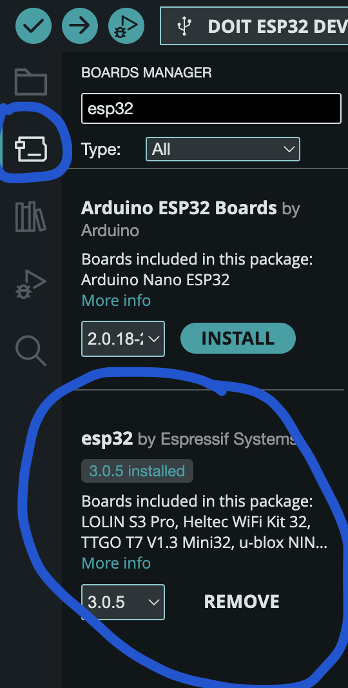 <br />
- Now select DOIT ESP32 DEVKIT V1.<br /><br />
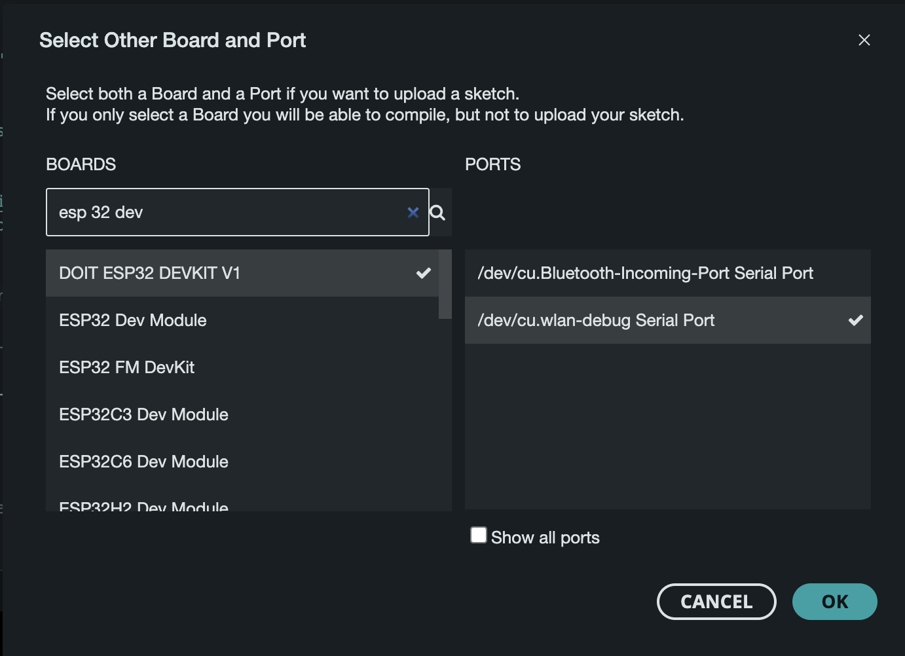 <br />
<br /><br /><br />

## Step 3: Install Libraries

You will need to install the following libraries:
- Adafruit NeoPixel: For controlling the NeoPixel LED strip.
- UniversalTelegramBot: For communication with the Telegram bot.<br /><br />
|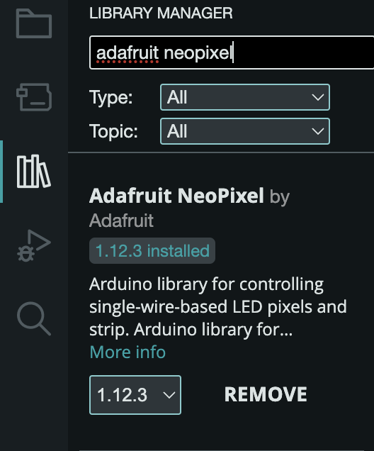 |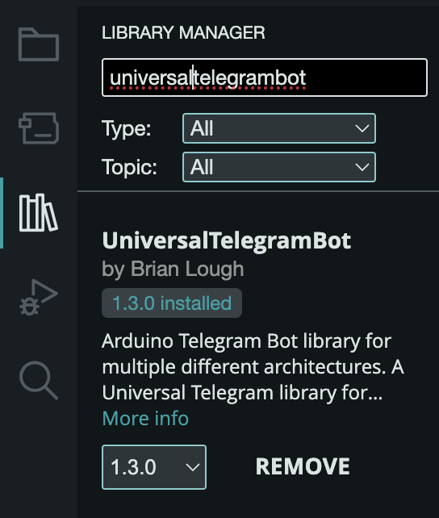|


<br /><br /><br />

## Step 4: Create a new Sketch
- Go to file -> New Sketch.<br /><br />
 <br />
<br /><br /><br />

## Step 5: Assemble Your board
Take your board and ledstrip and do the following:
- Put the GND cable on a GND pin
- Put the +5V cable on a 3V3 pin
- Put the DIN cable on any of your D pins, I used D5, as its closest to the rest of used pins, but it doesnt really matter which one you use.<br /><br />
|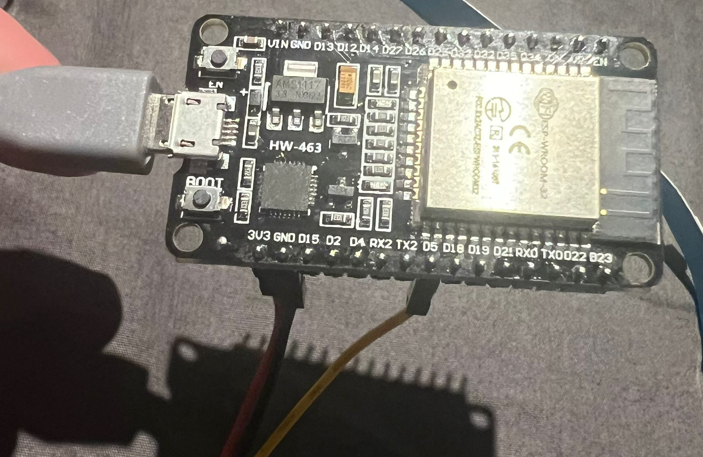 |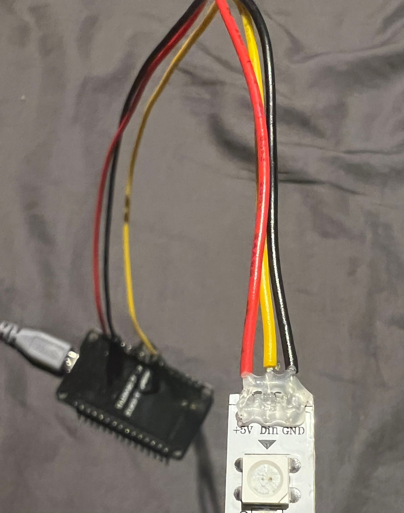|<br />
<br /><br /><br />


## Step 6: Code Setup
We will now ensure that all the required libraries are included, aswell as defining the key settings for our project. Copy the code and adjust the following
- Change the SSID to the name of your wifi network, Wifi password to the respective and Bot token to the token you recieved from the BotFather. The token should follow this structure: XXXXX:XXXXXXXXXXXXXXX
- Make sure the NUMPIXELS is equal to the amount of LEDs on your strip, there are 15 in my case.
- Adjust LED_PIN to the pin to which you added your ledstrip, the D5 pin in my case.


```
#include <WiFi.h>
#include <WiFiClientSecure.h>
#include <UniversalTelegramBot.h>
#include <Adafruit_NeoPixel.h>

// WiFi credentials
#define WIFI_SSID "your-SSID"
#define WIFI_PASSWORD "your-PASSWORD"

// Telegram bot token
#define BOT_TOKEN "your-telegram-bot-token"

// Pin connected to the NeoPixel strip
#define LED_PIN 5
#define NUMPIXELS 15  // Number of LEDs on the NeoPixel strip

Adafruit_NeoPixel strip(NUMPIXELS, LED_PIN, NEO_GRB + NEO_KHZ800);

WiFiClientSecure client;
UniversalTelegramBot bot(BOT_TOKEN, client);
```
<br /><br /><br />

## Step 7: Adding LPs
We are goin to need some LPs with different RPMs, so we'll add those in ourselves for now. You can add any amount off LPs, but in this case i asked ChatGPT for some populair ones, making sure 33, 45 and 78 RPM are all represented.
To simulate different vinyl albums and their respective RPMs, we’ll create a custom structure to store the names and RPMs of each LP. This information will be used to control the LED colors based on the selected LPs RPM.

```
// Define LP records and their corresponding RPM values
struct LPRecord {
  String name;  // Name of the album
  int rpm;      // RPM value of the album (e.g., 33, 45, 78)
};

// A list of LP records with their names and corresponding RPMs
LPRecord records[] = {
  {"Abbey Road", 33},
  {"Thriller", 45},
  {"Blue Train", 33},
  {"Kind of Blue", 33},
  {"Elvis Presley", 78}
};
```
<br /><br /><br />

## Step 8: Initializing Current Volume and Color
After initializing the NeoPixel strip, we also need to set up variables to keep track of the current volume and the color of the LEDs based on the selected LP’s RPM.
```
int currentVolume = NUMPIXELS;  // Start with all LEDs on (full volume)
uint32_t currentColor = strip.Color(255, 255, 255);  // Default color (white), will change based on LP RPM
```
currentVolumetracks the current volume level by determining how many LEDs are lit on the strip. It starts with all LEDs on (maximum volume).<br>
currentColor holds the color of the LEDs based on the selected LP’s RPM. It will be updated when you choose a new LP via the Telegram bot. Initially, it’s set to white.
<br /><br /><br />

## Step 9: Bot Commands
Now that we’ve set up the basics, it's time to implement the functionality that allows the Telegram bot to respond to user commands. The bot will handle two main types of interactions:
- Adjusting the volume by turning LEDs on or off. The LEDs pixels symbolise the volume, with all light on representing a full volume bar, and no lights on representing the volume being off.
- Changing the currently playing LP, which, depending on the record's RPM, adjusts to color of the strip, representing the different speeds with a different color.

We’re going to use two commands to adjust the volume:
- volume_up: This command increases the volume by turning on more LEDs.
- volume_down: This command decreases the volume by turning off LEDs.

Here's what the functionality behind that looks like
```
// Function to update LED strip based on the current volume and color
void updateVolumeDisplay() {
  strip.clear();  // Clear the LED strip
  for (int i = 0; i < currentVolume; i++) {
    strip.setPixelColor(i, currentColor);  // Set each active LED to the current color
  }
  strip.show();  // Update the strip with new settings
}
```
The code turns off all LEDs, then checks the current volume level to light up the right number of LEDs. It sets them to the color of the selected LPs RPM and updates the LED strip to show these changes.
<br /><br /><br />

### LP Selection<br />

When selecting a new LP, we will send the bot a message like “Put on Abbey Road.” The bot will look up the RPM for that LP and change the LED color accordingly. Here’s how we define the colors based on RPM:

- 33 RPM: Green.
- 45 RPM: Blue.
- 78 RPM: Red.

Here’s the code to handle the LP selection and change the LED color:
```
// Function to update the LED color based on the album's RPM
void setColorByRPM(int rpm) {
  if (rpm == 33) {
    currentColor = strip.Color(0, 255, 0);  // Green for 33 RPM
  } else if (rpm == 45) {
    currentColor = strip.Color(0, 0, 255);  // Blue for 45 RPM
  } else if (rpm == 78) {
    currentColor = strip.Color(255, 0, 0);  // Red for 78 RPM
  }
  updateVolumeDisplay();  // Apply the new color to the LED strip
}
```
Make sure you copy both of these pieces of code.
<br /><br /><br />

## Step 10: Void Setup
In the Void Setup, we start up our board, connect it to the internet, and set up the LED strip and Telegram bot.
- Open the serial monit and set the Baus rate to 115200.<br /><br />
|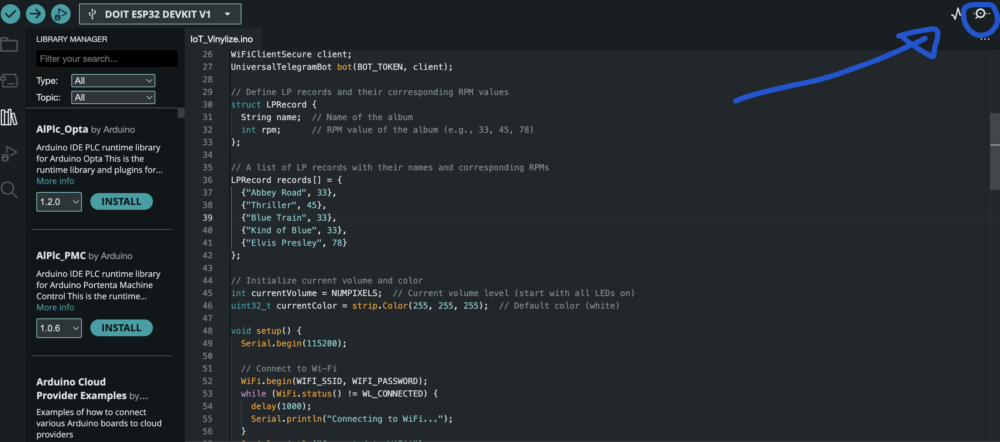 |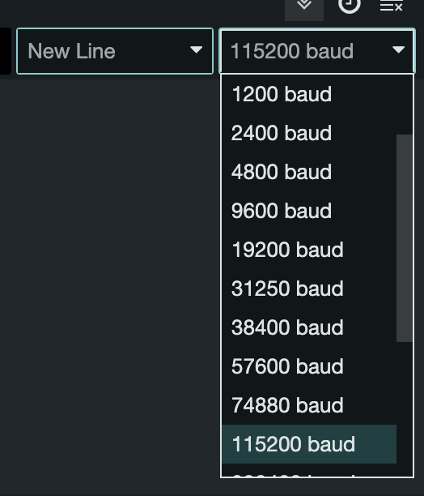|<br /><br />

Now put the following code in your file:
```
void setup() {
  // Initialize serial communication for debugging
  Serial.begin(115200);

  // Connect to Wi-Fi
  WiFi.begin(WIFI_SSID, WIFI_PASSWORD);
  while (WiFi.status() != WL_CONNECTED) {
    delay(1000);
    Serial.println("Connecting to WiFi...");
  }
  Serial.println("Connected to WiFi");

  // Initialize the NeoPixel LED strip
  strip.begin();
  strip.show();  // Turn off all LEDs initially

  // Allow insecure connection to Telegram servers (ESP32)
  client.setInsecure();
}
```
This code does the following:
- The function starts by initializing serial communication, allowing you to send and receive debug messages to and from the computer’s serial monitor.
- It then attempts to connect to the specified Wi-Fi network using the provided credentials. If the connection is not successful, it will keep trying, printing messages to indicate its status. Once connected, it confirms this with a message.
- After establishing a Wi-Fi connection, the function initializes the NeoPixel LED strip, ensuring that all the LEDs are turned off initially.
- It allows you to make insecure connections to the Telegram servers. Be careful with this, as it could lead to some privacy risks. Only use this line when testing out the code or when using it for personal use.
<br /><br /><br />

## Step 11: Void Loop
Almost done now. We just need to add the Loop function. This function continuously checks for new messages sent to the Telegram Bot, which then responds accordingly.
```
void loop() {
  // Check for new messages from Telegram
  int numNewMessages = bot.getUpdates(bot.last_message_received + 1);

  for (int i = 0; i < numNewMessages; i++) {
    String text = bot.messages[i].text;
    String chat_id = bot.messages[i].chat_id;

    // Handle "Volume up" command
    if (text == "Volume up") {
      if (currentVolume < NUMPIXELS) {
        currentVolume++;
        setVolumeLevel(currentVolume);
        bot.sendMessage(chat_id, "Volume increased", "");
      } else {
        bot.sendMessage(chat_id, "Volume is at maximum", "");
      }
    }

    // Handle "Volume down" command
    else if (text == "Volume down") {
      if (currentVolume > 0) {
        currentVolume--;
        setVolumeLevel(currentVolume);
        bot.sendMessage(chat_id, "Volume decreased", "");
      } else {
        bot.sendMessage(chat_id, "Volume is at minimum", "");
      }
    }

    // Handle "Put on [LP name]" command
    else if (text.startsWith("Put on")) {
      String lpName = text.substring(7);  // Extract the LP name from the message

      // Search for the LP in the records list and change LED color based on RPM
      bool lpFound = false;
      for (int j = 0; j < sizeof(records) / sizeof(records[0]); j++) {
        if (records[j].name == lpName) {
          currentColor = setColorForRPM(records[j].rpm);  // Set currentColor to the color based on RPM
          currentVolume = NUMPIXELS;  // Reset volume to maximum (all LEDs on)
          bot.sendMessage(chat_id, "Playing " + lpName + " at " + records[j].rpm + " RPM", "");
          lpFound = true;
          break;
        }
      }
      if (!lpFound) {
        bot.sendMessage(chat_id, "LP not found", "");
      }
    }

    // Handle unrecognized commands
    else {
      bot.sendMessage(chat_id, "Unknown command. Please try 'Volume up', 'Volume down', or 'Put on [LP]'", "");
    }
  }

  delay(1000);  // Adjust delay to reduce polling frequency if needed
}
```
- The loop begins by checking for new messages from the Telegram bot.
- It then looks at which message has been sent. The messages it knows are "Volume up", "Volume down" and "Put on [LP name]". If a different message is sent, the bot responds with "Unknown command. Please try 'Volume up', 'Volume down', or 'Put on [LP]'".
- Based on which command has been sent, the bot can do a few things:
  - If the command is "Volume up", the bot checks if the current volume is below the maximum. If so, it increments currentVolume, updates the LED strip, and sends a confirmation message; otherwise, it informs the user that the volume is at maximum.
  - For the "Volume down" command, the bot decrements currentVolume if it’s above zero, updates the LED strip, and sends a confirmation message. If the volume is already at minimum, it notifies the user.
  - When the command is "Put on [LP name]", the bot extracts the LP name and searches the predefined list of records for a match. If found, it updates the LED color based on the record's RPM, resets the volume to maximum, and sends a confirmation message; if not found, it sends an error message.
<br /><br /><br />

## Step 12: Test it Out!
Your now done! Run the code by pressing the arrow on the top left as seen below.<br /><br />
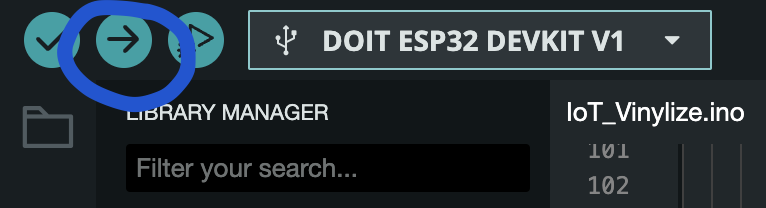 <br /><br />
This should give you an output message, as seen below.<br /><br />
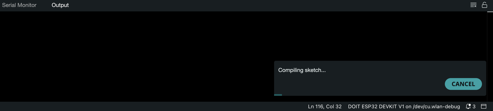 <br /><br />
Now wait until compiling is finished. You might run into an error here, like the following one:<br /><br />
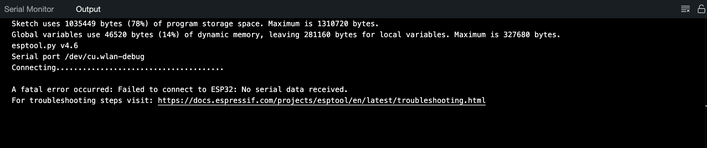 <br /><br />
The error message "Failed to connect to ESP32: No serial data received" usually means that the ESP32 board is not communicating properly with your computer through the serial port. Here are a few steps to troubleshoot and resolve the issue:
1. Check the ESP32 is properly connected
   - Ensure the ESP32 is connected to your computer via a good quality USB cable that supports data transfer, not just charging. Try using       a different cable if needed.
   - Verify that the USB connection is secure at both ends.
2. Select the correct Port in the Arduino IDE
   - In Arduino IDE, go to Tools > Port and select the correct serial port associated with your ESP32. This should be labeled as something       like COMx on Windows or /dev/cu.SLAB_USBtoUART on macOS.
   - If you don’t see any available ports, try unplugging the device and plugging it back in.
3. Select the correct board
   - Make sure you have selected the correct board from the Tools > Board menu. For ESP32, select DOIT ESP32 DEVKIT V1 or the relevant           board you're using.
  
If you have that resolved, the file should start uploading:<br /><br />
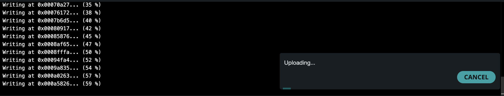 <br /><br />

The upload is complete when you see the following:<br /><br />
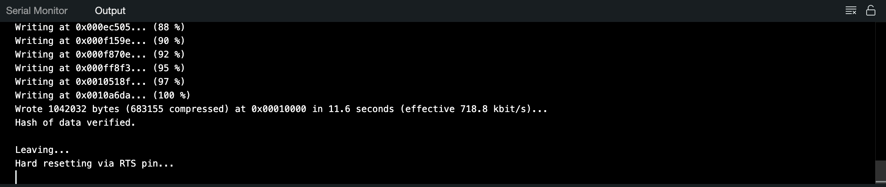 <br /><br />

Now head to the serial monitor. You should see that your board is trying to connect to Wifi:<br /><br />
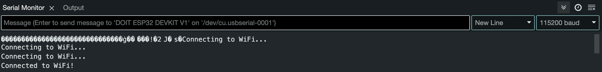 <br /><br />

If you get any errors here, you might have to look at whether ot not you copied the following code and edited it correctly:
```
#include <WiFi.h>
#include <WiFiClientSecure.h>
#include <UniversalTelegramBot.h>
#include <Adafruit_NeoPixel.h>

// WiFi credentials
#define WIFI_SSID "your-SSID"
#define WIFI_PASSWORD "your-PASSWORD"

// Telegram bot token
#define BOT_TOKEN "your-telegram-bot-token"

// Pin connected to the NeoPixel strip
#define LED_PIN 5
#define NUMPIXELS 15  // Number of LEDs on the NeoPixel strip

Adafruit_NeoPixel strip(NUMPIXELS, LED_PIN, NEO_GRB + NEO_KHZ800);

WiFiClientSecure client;
UniversalTelegramBot bot(BOT_TOKEN, client);
```

If your board has succesfully connected to the wifi, you can start messaging your Telegram bot. In my case, i asked the bot to put on Elvis Presley, which has an RPM of 78, which we decided to make red. I then asked it to lower the voluem five times and raise it once, which resulted in the LED strip to be red, with 4 pixels turned off.<br /><br />
|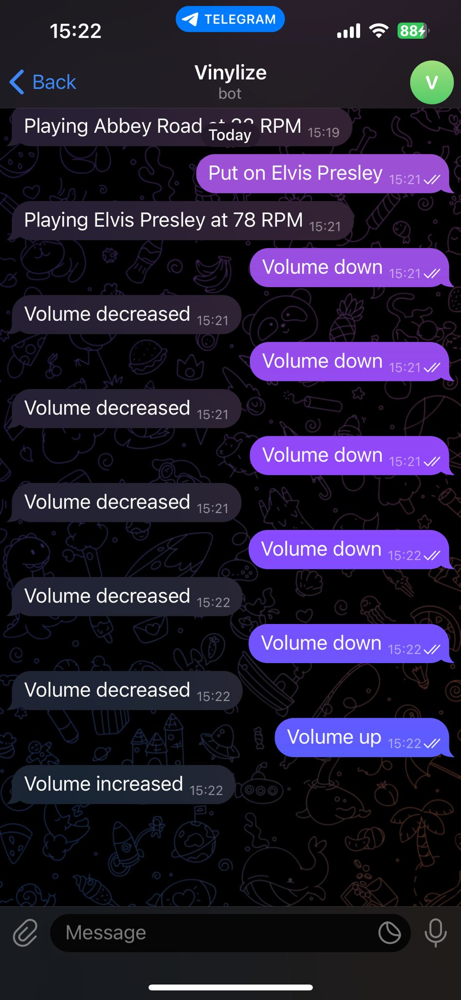 |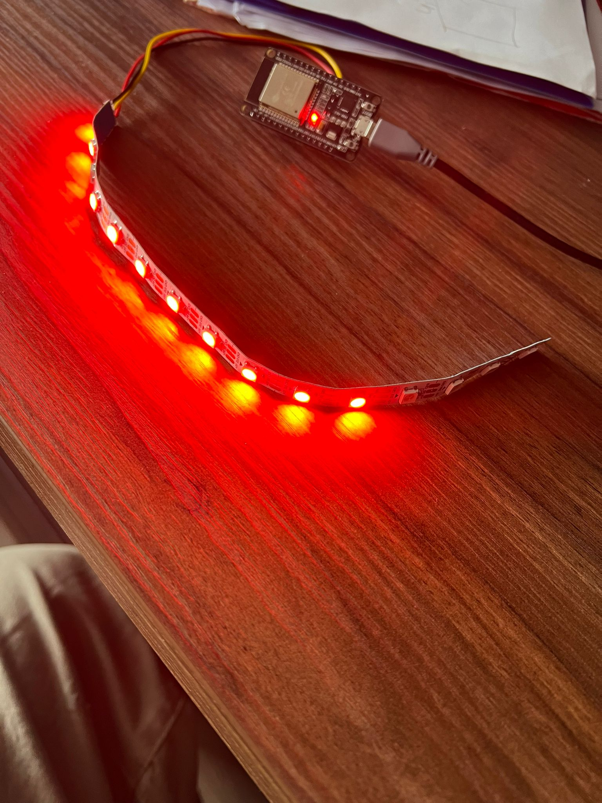|<br />
<br /><br /><br />


## Code up Until Now
With everything explained, here is the complete code that has been used until now:
```
#include <WiFi.h>
#include <WiFiClientSecure.h>
#include <UniversalTelegramBot.h>
#include <Adafruit_NeoPixel.h>

// WiFi credentials
#define WIFI_SSID "your-SSID"
#define WIFI_PASSWORD "your-PASSWORD"

// Telegram bot token
#define BOT_TOKEN "your-telegram-bot-token"

// Pin connected to the NeoPixel strip
#define LED_PIN 5
#define NUMPIXELS 15  // Number of LEDs on the NeoPixel strip

Adafruit_NeoPixel strip(NUMPIXELS, LED_PIN, NEO_GRB + NEO_KHZ800);

WiFiClientSecure client;
UniversalTelegramBot bot(BOT_TOKEN, client);

// Define LP records and their corresponding RPM values
struct LPRecord {
  String name;  // Name of the album
  int rpm;      // RPM value of the album (e.g., 33, 45, 78)
};

// A list of LP records with their names and corresponding RPMs
LPRecord records[] = {
  {"Abbey Road", 33},
  {"Thriller", 45},
  {"Blue Train", 33},
  {"Kind of Blue", 33},
  {"Elvis Presley", 78}
};

// Initialize current volume and color
int currentVolume = NUMPIXELS;  // Current volume level (start with all LEDs on)
uint32_t currentColor = strip.Color(255, 255, 255);  // Default color (white)

// Function to update LED strip based on the current volume and color
void updateVolumeDisplay() {
  strip.clear();  // Clear the LED strip
  for (int i = 0; i < currentVolume; i++) {
    strip.setPixelColor(i, currentColor);  // Set each active LED to the current color
  }
  strip.show();  // Update the strip with new settings
}

// Function to update the LED color based on the album's RPM
void setColorByRPM(int rpm) {
  if (rpm == 33) {
    currentColor = strip.Color(0, 255, 0);  // Green for 33 RPM
  } else if (rpm == 45) {
    currentColor = strip.Color(0, 0, 255);  // Blue for 45 RPM
  } else if (rpm == 78) {
    currentColor = strip.Color(255, 0, 0);  // Red for 78 RPM
  }
  updateVolumeDisplay();  // Apply the new color to the LED strip
}

void setup() {
  Serial.begin(115200);

  WiFi.begin(WIFI_SSID, WIFI_PASSWORD);
  while (WiFi.status() != WL_CONNECTED) {
    delay(1000);
    Serial.println("Connecting to WiFi...");
  }
  Serial.println("Connected to WiFi");

  strip.begin();
  strip.show();

  // Allow insecure connection to Telegram servers (ESP32)
  client.setInsecure();
}

void loop() {
  // Check for new messages from Telegram
  int numNewMessages = bot.getUpdates(bot.last_message_received + 1);

  for (int i = 0; i < numNewMessages; i++) {
    String text = bot.messages[i].text;
    String chat_id = bot.messages[i].chat_id;

    // Handle "Volume up" command
    if (text == "Volume up") {
      if (currentVolume < NUMPIXELS) {
        currentVolume++;
        setVolumeLevel(currentVolume);
        bot.sendMessage(chat_id, "Volume increased", "");
      } else {
        bot.sendMessage(chat_id, "Volume is at maximum", "");
      }
    }

    // Handle "Volume down" command
    else if (text == "Volume down") {
      if (currentVolume > 0) {
        currentVolume--;
        setVolumeLevel(currentVolume);
        bot.sendMessage(chat_id, "Volume decreased", "");
      } else {
        bot.sendMessage(chat_id, "Volume is at minimum", "");
      }
    }

    // Handle "Put on [LP name]" command
    else if (text.startsWith("Put on")) {
      String lpName = text.substring(7);  // Extract the LP name from the message

      // Search for the LP in the records list and change LED color based on RPM
      bool lpFound = false;
      for (int j = 0; j < sizeof(records) / sizeof(records[0]); j++) {
        if (records[j].name == lpName) {
          currentColor = setColorForRPM(records[j].rpm);  // Set currentColor to the color based on RPM
          currentVolume = NUMPIXELS;  // Reset volume to maximum (all LEDs on)
          bot.sendMessage(chat_id, "Playing " + lpName + " at " + records[j].rpm + " RPM", "");
          lpFound = true;
          break;
        }
      }
      if (!lpFound) {
        bot.sendMessage(chat_id, "LP not found", "");
      }
    }

    // Handle unrecognized commands
    else {
      bot.sendMessage(chat_id, "Unknown command. Please try 'Volume up', 'Volume down', or 'Put on [LP]'", "");
    }
  }

  delay(1000);  // Adjust delay to reduce polling frequency if needed
}
```

## Step 13: Discogs API
The code works pretty well right now, but we only have a couple different LPs. On top off that, we had to add all of these ourselves, which means that if we want 100 records, we would be here for a while. That were APIs come in, as they already have this data for us. APIs (Application Programming Interfaces) enable communication between software systems, allowing them to share data and functionality seamlessly. Discogs is an online database and marketplace for music releases, focusing on vinyl records, CDs, and other formats. They just so happen to have an API that we can use in our code, so that we can have acces to all of their data.
- Visit https://www.discogs.com/settings/developers and click the "Generate new Token" button to get your own API Key.
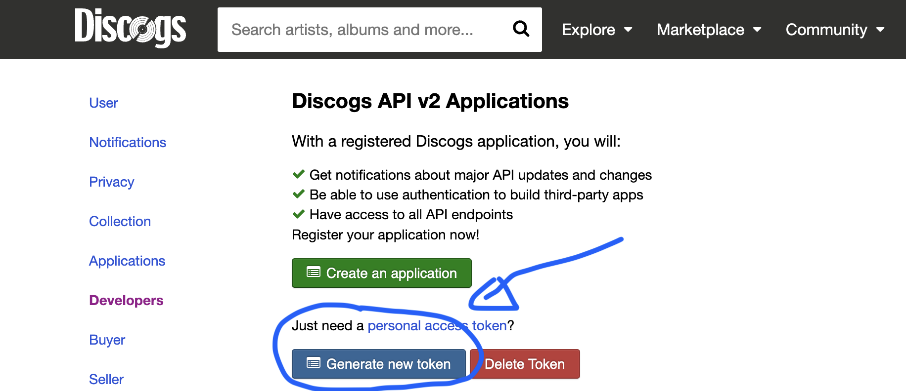<br />
<br /><br /><br />

## Step 14: Extra Libraries
Now that we have our API key, we need to add it to our code. However, we need to install some new libraries first. Go to your library manager and install the following libraries:
- Arduino_Json: This library simplifies working with JSON data in Arduino projects, which is what is used when orking with APIs. 
- ArduinoHttpClient: This library allows Arduino devices to send and receive HTTP requests and responses.
<br /><br />
|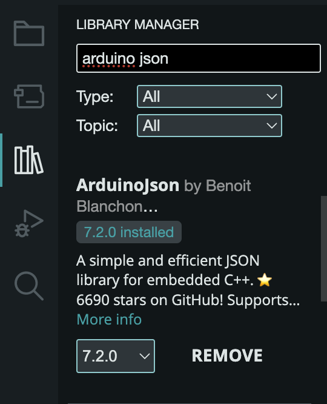 |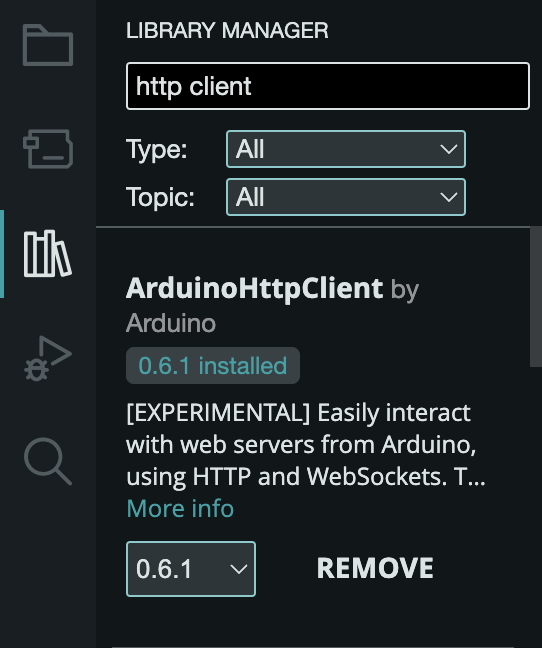|<br />
<br /><br /><br />

## Step 15: Updated Setup
- Add the code below to the top of yout code to add our new libraries and define our API:
```
#include <WiFi.h>
#include <WiFiClientSecure.h>
#include <UniversalTelegramBot.h>
#include <Adafruit_NeoPixel.h>
#include <ArduinoJson.h>
#include <HTTPClient.h>

// WiFi credentials
#define WIFI_SSID "your-SSID"
#define WIFI_PASSWORD "your-PASSWORD"

// Telegram bot token
#define BOT_TOKEN "your-telegram-bot-token"

// Discogs API credentials
#define DISCOGS_API_URL "https://api.discogs.com/"
#define DISCOGS_API_TOKEN "your-API-TOKEN"


// Pin connected to the NeoPixel strip
#define LED_PIN 5
#define NUMPIXELS 15  // Number of LEDs on the NeoPixel strip

Adafruit_NeoPixel strip(NUMPIXELS, LED_PIN, NEO_GRB + NEO_KHZ800);

WiFiClientSecure client;
UniversalTelegramBot bot(BOT_TOKEN, client);
```
Make sure you change your ssid, wifi password, bot token and API token
<br /><br /><br />

## Step 16:
