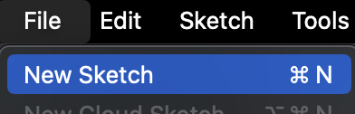

# Vinylize_IoT

With this guide i will show you how to control a ledstrip using a telegram bot, to simulate a digitally controlled vinyl record player. You wil be able to change the album and automatically switch to that albums RPM, aswell as adjusting the volume.
   

# Requirements:
- ESP32 DevKit V1 board
- NeoPixel LED strip 
- Wires
- Laptop with the Arduino IDE installed
- Internet connection
- Phone with Telegram installed
   

# Step 1: Creating your Telegram Bot

- Open Telegram and search for the BotFather.
- Use the command "/newbot" to create a new bot.
- Give the bot a name and username.
- Save the bot token, which will be used in your code to connect to the bot.  
  
  
You can now message your new bot. Make sure you are chatting with your own bot, and not with the BotFather.   
 
 You can click the link to go to your own bot.  
  
 To get this response from your own bot, you will have to keep following the guide.
   

# Step 2: Set Up Your ESP32 with Arduino IDE

- Go to Tools -> Boards -> Board Manager.  
  
- While here, look for esp32 and install esp32 by Espressif Systems.  
  
- Now select DOIT ESP32 DEVKIT V1.  
  
   

# Step 3: Install Libraries

You will need to install the following libraries:
- Adafruit NeoPixel: For controlling the NeoPixel LED strip.
- UniversalTelegramBot: For communication with the Telegram bot.  
| ||

   

# Step 4: Create a new Sketch
- Go to file -> New Sketch.  
  
   

# Step 5: Code setup
- Copy the code

         
Visit https://www.discogs.com/settings/developers and click the "genrate new Token" button to get your API Key.
